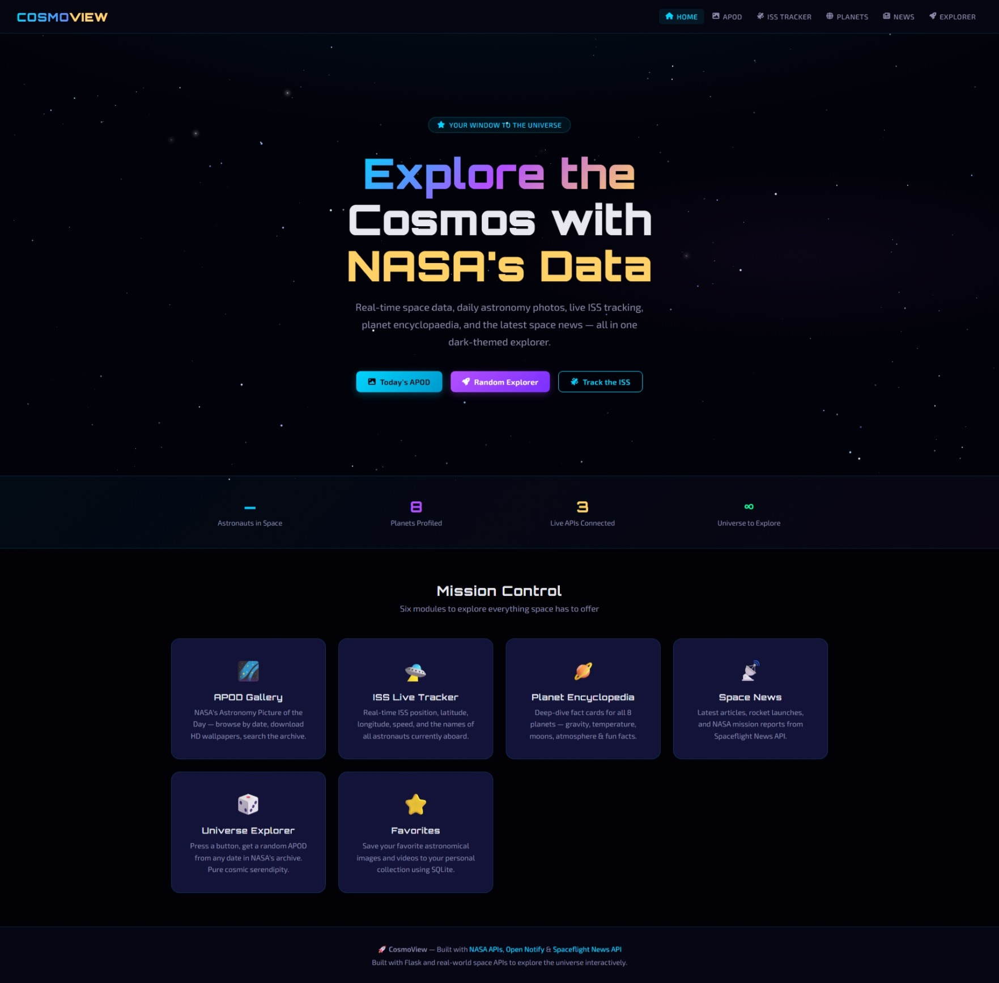
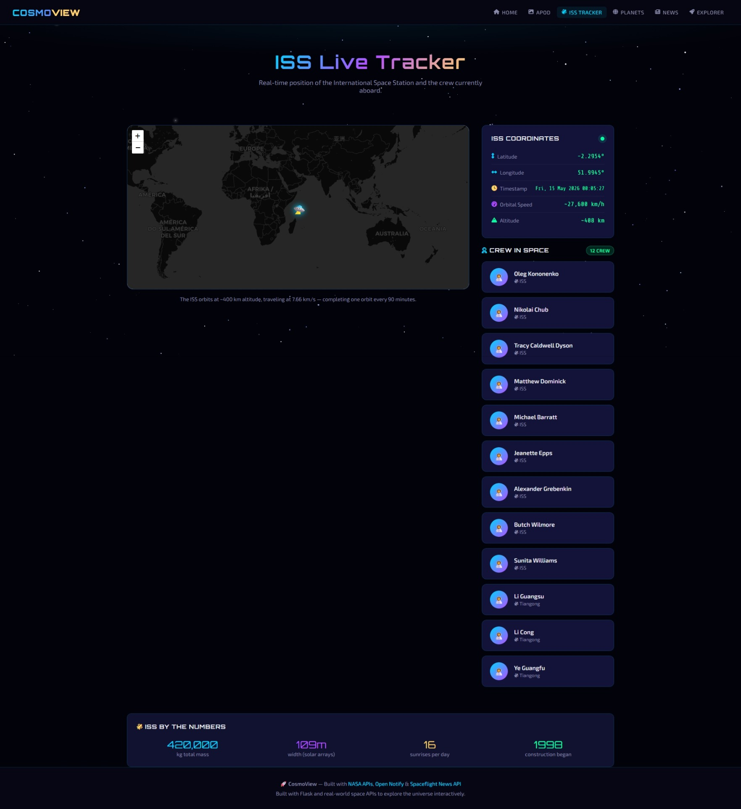
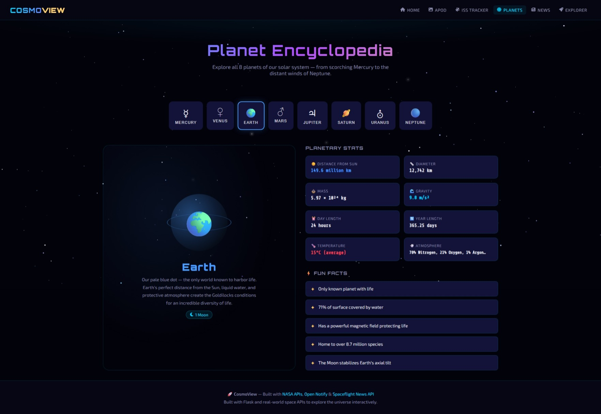
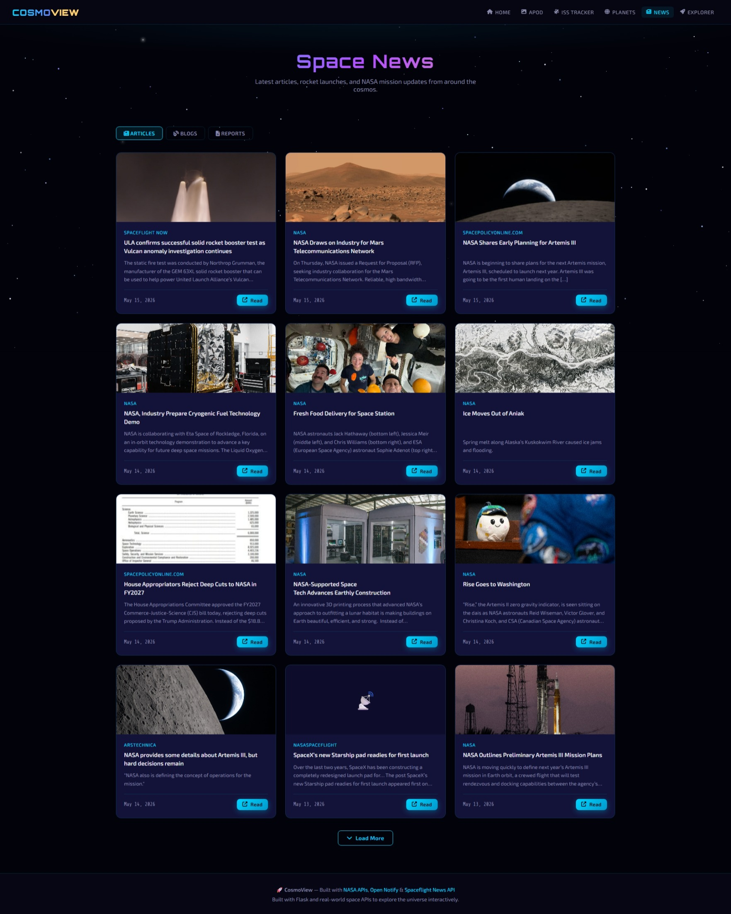

# 🚀 CosmoView — Space & Astronomy Explorer

Explore the cosmos with NASA’s data through an interactive Flask-powered astronomy web application.

---

## ✨ Features

| Module | Description |
|---|---|
| 🌌 **APOD Gallery** | NASA's Astronomy Picture of the Day — browse by date, HD lightbox, download wallpapers, save favorites |
| 🛸 **ISS Live Tracker** | Real-time ISS location on an interactive map, live lat/lng updates every 5s, current crew list |
| 🪐 **Planet Encyclopedia** | All 8 planets with gravity, temperature, moons, atmosphere, and fun facts |
| 📡 **Space News** | Articles, blogs, and reports from the Spaceflight News API |
| 🎲 **Universe Explorer** | Random APOD from any date in NASA's archive — pure cosmic serendipity |
| ⭐ **Favorites** | Save APOD images to a local SQLite database |

---

## 🛠 Tech Stack

- **Backend**: Python 3.10+, Flask 3
- **Database**: SQLite (via Python's built-in `sqlite3`)
- **Frontend**: HTML5, CSS3 (custom dark-space theme), Vanilla JavaScript
- **APIs Used**:
  - [NASA APOD API](https://api.nasa.gov/) — free key at api.nasa.gov
  - [Open Notify](http://open-notify.org/) — ISS position & astronauts
  - [Spaceflight News API v4](https://api.spaceflightnewsapi.net/) — space news

---
## 📸 Screenshots

### Home Page


### ISS Tracker


### Planet Encyclopedia


### News


### Astronomy Picture of the Day
              
  _ _ _

## ⚡ Quick Start

### 1. Clone / Download this project

```bash
cd cosmoview
```

### 2. Create a virtual environment (recommended)

```bash
python -m venv venv
# Windows:
venv\Scripts\activate
# Mac/Linux:
source venv/bin/activate
```

### 3. Install dependencies

```bash
pip install -r requirements.txt
```

### 4. Get your free NASA API key

Visit **https://api.nasa.gov/** and sign up for a free key.
Open `app.py` and replace:
```python
NASA_API_KEY = "DEMO_KEY"
```
with your actual key (DEMO_KEY works but has lower rate limits).

### 5. Run the app

```bash
python app.py
```

Open your browser at **http://localhost:5000** 🎉

---

## 📁 Project Structure

```
cosmoview/
├── app.py                  # Flask routes + API endpoints
├── requirements.txt        # Python dependencies
├── cosmoview.db            # SQLite database (auto-created)
└── templates/
    ├── base.html           # Shared layout, nav, starfield, styles
    ├── index.html          # Homepage with hero + feature cards
    ├── apod.html           # APOD gallery page
    ├── iss.html            # ISS live tracker
    ├── planets.html        # Planet encyclopedia
    ├── news.html           # Space news feed
    └── explorer.html       # Random universe explorer
```

---

## 🎓📚 Concepts Demonstrated

- Flask routing and Jinja2 templating
- Calling real-world REST APIs with `requests`
- JSON parsing and data handling
- SQLite CRUD operations (favorites)
- Responsive CSS with dark theme + animations
- JavaScript fetch API for async data loading
- Interactive maps with Leaflet.js


## 🔑 API Keys & Rate Limits

| API | Key Required | Free Tier |
|---|---|---|
| NASA APOD | Yes (free) | 1,000 req/hour |
| Open Notify | No | Unlimited |
| Spaceflight News | No | Unlimited |

---

Built with ❤️ and using Flask, real-time APIs, NASA’s open space data.
